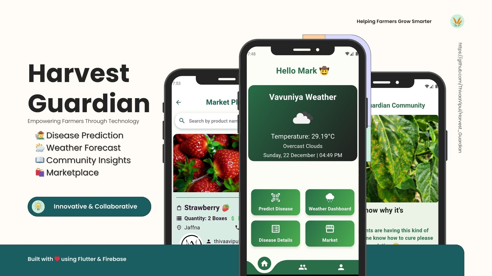
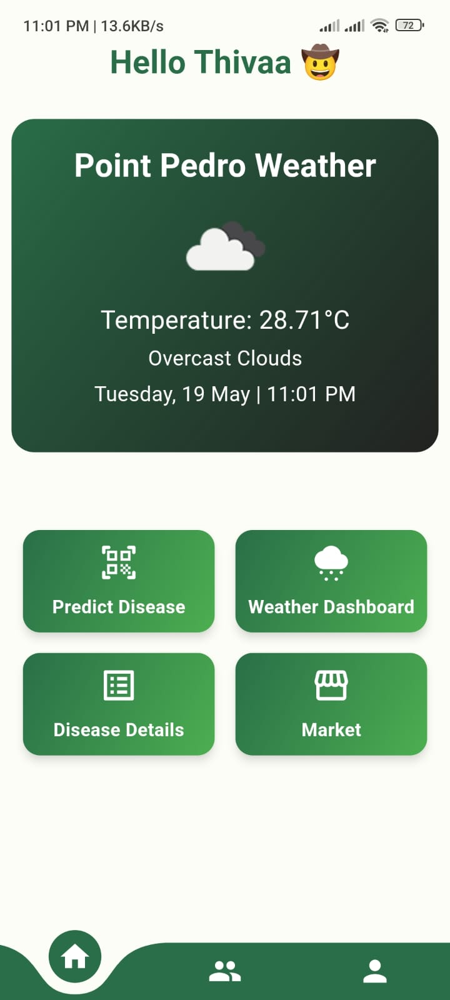
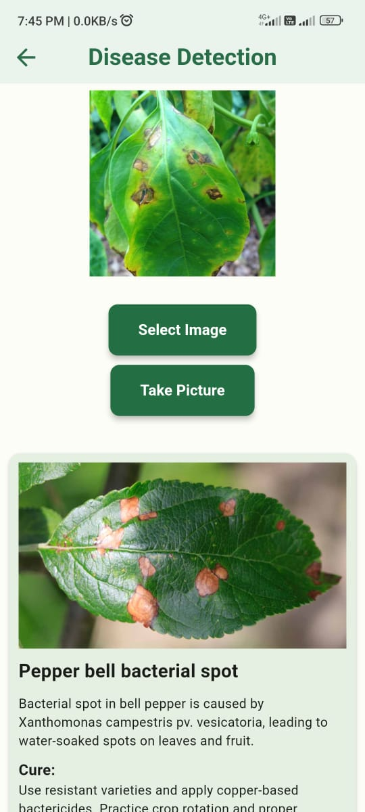
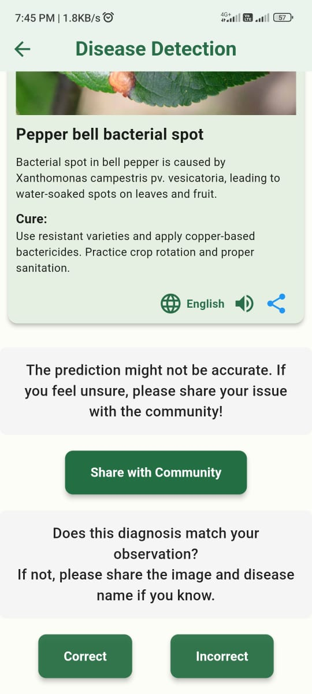
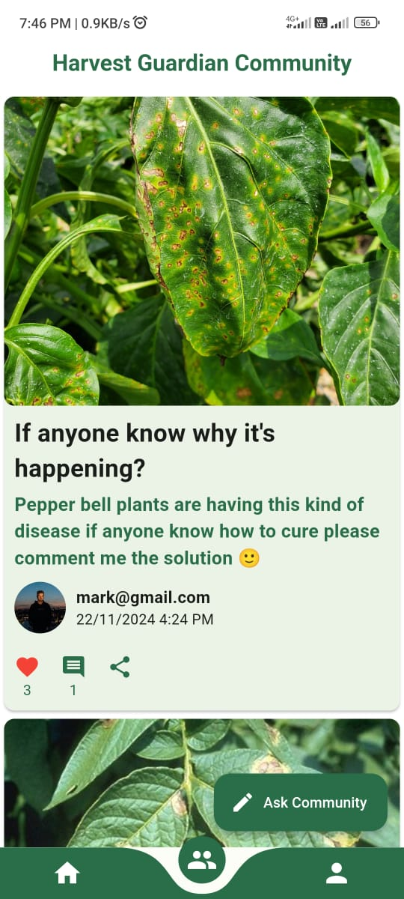

<div align="center">



<br/>
<br/>

[](https://flutter.dev)
[](https://dart.dev)
[](https://firebase.google.com)
[](https://www.tensorflow.org/lite)
[](https://developer.android.com)

<br/>

🏆 **2nd Place** at University of Vavuniya Technology Exhibition &nbsp;|&nbsp; 📄 **Published at RCAICT 2025**

</div>

---

## Overview

Agriculture in Sri Lanka is predominantly driven by smallholder farmers who face challenges in timely disease detection, access to expert advice, and planning around unpredictable weather. **Harvest Guardian** is a Flutter mobile application that brings AI-powered crop disease detection, real-time weather forecasting, a peer community forum, and a direct-to-buyer marketplace into a single, offline-capable toolkit purpose-built for farmers in low-connectivity environments.

---

## Screenshots

<div align="center">
<table>
  <tr>
    <td align="center"><br/><sub><b>Home Dashboard</b></sub></td>
    <td align="center"><br/><sub><b>Disease Detection</b></sub></td>
    <td align="center"><br/><sub><b>Result & Feedback</b></sub></td>
    <td align="center"><br/><sub><b>Community Forum</b></sub></td>
  </tr>
</table>
</div>

---

## Features

### 🔬 On-Device Crop Disease Detection
- Capture a leaf photo or pick from gallery. **No internet required** for inference
- Powered by a TensorFlow Lite model detecting across **30 crop disease classes**
- Results include the disease name, cause, and actionable cure recommendations
- **Multilingual support** with text-to-speech output for farmers who prefer audio
- Built-in feedback loop: mark predictions as **Correct / Incorrect** to support future model improvement
- One-tap **"Share with Community"** when the farmer needs a second opinion

### 🌤️ Localized Weather Forecasting
- Real-time weather pulled from the farmer's GPS location
- Displays temperature, condition, and timestamp on the home dashboard
- Full weather dashboard for extended forecast details

### 🌱 Peer Community Forum
- Farmers post crop issues with photos and get advice from the community
- Comments with upvoting to surface the best answers
- Seamlessly connected to the disease detection flow

### 🛒 Agricultural Marketplace
- Farmers list produce for direct-to-buyer trading
- Browse and search listings by product name and location

### 🔐 Authentication
- Email/password and **Google Sign-In** via Firebase Authentication
- Password reset flow included

---

## Tech Stack

| Layer | Technology |
|---|---|
| Mobile Framework | Flutter (Dart) |
| On-Device ML | TensorFlow Lite |
| Authentication | Firebase Authentication |
| Database | Firebase Firestore |
| Media Storage | Firebase Storage |
| Weather | OpenWeatherMap API |
| Platform | Android |

---

## Getting Started

### Prerequisites
- Flutter SDK `>=3.0.0`
- Android Studio or VS Code with the Flutter extension
- A Firebase project with Firestore, Authentication, and Storage enabled
- An [OpenWeatherMap](https://openweathermap.org/api) API key

### Setup

**1. Clone the repository**
```bash
git clone https://github.com/ThivaaVipul/Harvest_Guardian.git
cd Harvest_Guardian
```

**2. Install dependencies**
```bash
flutter pub get
```

**3. Configure Firebase**
- Create a project at [console.firebase.google.com](https://console.firebase.google.com)
- Add an Android app and download `google-services.json`
- Place it in `android/app/`
- Enable **Email/Password** and **Google Sign-In** under Authentication
- Set up Firestore and Storage with appropriate rules

**4. Add your OpenWeatherMap API key**
- Locate the weather service file and replace the placeholder with your API key

**5. Run the app**
```bash
flutter run
```

---

## Known Limitations

- The TFLite model was sourced from an open-source repository and has **not been retrained** on locally collected Sri Lankan crop datasets, so detection accuracy may vary for region-specific diseases
- Formal field testing with farmers is pending
- Currently Android-only

---

## Research Publication

This project was presented as a conference abstract at **RCAICT 2025** (2nd Research Conference on Advances in Information and Communication Technology), hosted by the Faculty of Technological Studies, University of Vavuniya.

> Thivakaran, V.; Thisakaran, R. *"Harvest Guardian: A Mobile Toolkit for AI-Based Crop Disease Diagnosis and Farmer Decision Support."* RCAICT 2025, University of Vavuniya, Sri Lanka.

📄 [View Published Abstract](http://drr.vau.ac.lk/handle/123456789/1418)

---

## Author

**Thivakaran VipulananthaAdigal**
<br/>
BICT (Hons), University of Vavuniya, Sri Lanka

[](https://github.com/ThivaaVipul)
[](https://www.linkedin.com/in/thivakaran-vipulananthaadigal/)

---

<div align="center">
Built with ❤️ using Flutter & Firebase
</div>
